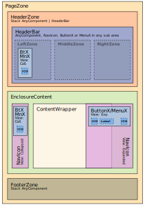

# AppmiteUI — layout global componível para dashboards

AppmiteUI é uma biblioteca de estrutura de layout autoaninhável para dashboards e subaplicativos. O núcleo deve ser consumível sem framework ou bundler; integrações com Vite, React, Preact, Zag.js, Font Awesome e Web Awesome são adaptadores/providers opcionais.

O contrato normativo completo está em [RCF.md](RCF.md). O estado das evoluções incrementais está em [handoff.md](handoff.md). O diagnóstico e o roadmap de adequação estão em [docs/adequacao-rcf-agents.md](docs/adequacao-rcf-agents.md). Este README apresenta a arquitetura sem substituir essas fontes.

`assets/ui.svg` é a fonte autoritativa da arquitetura visual idealizada e integra o contrato dos cabeçalhos TS/TSX consolidados no RCF.



#### Notas Explicativas do Diagrama de Interface:
*   **Abreviações Taxonômicas:** Os identificadores triliterais no diagrama são abreviações semânticas estritas de nomenclatura (ex: `Btx` = *ButtonX*; `MnX` = *MenuX*).
*   **Polimorfismo de Estado do NavIcon:** O componente à direita pertence à mesma classe/tipo conceitual do `NavIcon`, mas é demonstrado em um estado de exibição distinto para ilustrar o comportamento dinâmico do elemento; ele renderiza de forma aberta (expandida) e sobreposta ao `ContentWrapper` — sem paridade de largura com o elemento simétrico à esquerda —, revelando o fundo por transparência conforme o estado literal `'Coll.'` (colapsado) ou `'exp'` (expandido) injetado na propriedade `View`.
*   **Filiação Hierárquica:** Os recuos e distâncias de borda exibidos entre componentes pais e filhos servem unicamente como âncoras visuais de filiação estrutural no esquema, não definindo regras mandatórias de *margin* ou *padding* de estilização.

## Compatibilidade e independência tecnológica

O núcleo utiliza contratos Web padrão e permanece framework-agnostic. Integrações nativas ampliam a experiência sem se tornarem dependências arquiteturais; novos adaptadores e providers podem ser adicionados sem alterar o core. A matriz normativa e seus critérios verificáveis estão no [RCF, §3](RCF.md#3-independência-compatibilidade-e-adaptadores) e no [RCF, §12](RCF.md#12-validação-e-critérios-de-aceite).

| Cenário | Modos suportados |
| --- | --- |
| Vanilla | JavaScript, TypeScript e Sass, sem framework |
| Vite | sem framework, com React ou com Preact |
| Frameworks | React ou Preact, ambos opcionais |
| DaisyUI | com ou sem |
| Font Awesome | com ou sem; fallback por emoji, conteúdo acessível ou implementação manual |
| WebAwesome / Web Awesome | com ou sem; provider/adaptador opcional |
| ZagJS / Zag.js | com ou sem; adaptador de estado opcional |

Nenhuma integração da tabela é obrigatória. Compatibilidade declarada não pode regredir, e a ausência de cada opcional deve ser validada sem dependência transitiva acidental.

### Perfis oficiais recomendados

- **Principal:** Vite + Preact + ZagJS + Font Awesome + WebAwesome.
- **Alternativo:** Vanilla + Sass + Font Awesome + WebAwesome.

Os perfis são recomendações oficiais, não requisitos de instalação. Cada item continua substituível ou removível conforme o contrato de providers e adaptadores do RCF.

### Formas de integração e demonstração

- consumo direto do core por JavaScript/TypeScript e CSS gerado de Sass;
- adaptadores independentes para React e Preact;
- provider substituível de ícones, com Font Awesome como opção e fallback sem provider;
- provider/adaptador opcional de primitives com Web Awesome;
- adaptador opcional de estado com Zag.js;
- ponte opcional de build com Vite, sem transformar Vite em API pública.

As demonstrações e fixtures independentes da matriz serão materializadas incrementalmente pelas FT-002, FT-003, FT-004 e FT-006, reutilizando casos comuns sem compartilhar dependências opcionais entre cenários.

## 🔷 Arquitetura Geral

### Componentes

- ButtonX
- ContentWrapper
- EnclosureContent
- FooterZone
- HeaderBar
- HeaderZone
- MenuX
- NavIcon
- PageZone

### Hierarquia geral

```
[PageZone]
├── (HeaderZone)  // Pelo menos um destes ↓ deve existir (AnyComponent* ou HeaderBar*)
│     ├── (AnyComponent*) // stack
│     └── (HeaderBar*)  //^2
│           ├── [LeftZone] //^3
│           │     ├── (breadcrumbs*) //^2
│           │     ├── (AnyComponents*) //^2
│           │     └── (ButtonX+/MenuX+)  //^1
│           ├── [MiddleZone] //^3
│           │     ├── (breadcrumbs*) //^2
│           │     ├── (AnyComponents*) //^2
│           │     └── (ButtonX+/MenuX+)  //^1
│           └── [RightZone] //^3
│                 ├── (breadcrumbs*) //^2
│                 ├── (AnyComponents*) //^2
│                 └── (ButtonX+/MenuX+)  //^1
├── EnclosureContent
│   ├── (NavIcon)  // left
│   │     └── [ButtonX+]
│   ├── ContentWrapper   [obrigatório]
│   │    └── (PageZone) ^ [AnyComponent+]  // XOR
│   └── (NavIcon) // right
│         └── [ButtonX+]
└── (FooterZone)
      └── [AnyComponent+]  //#2
```

### Em designer ASCII:

```
+----------------------------------+
| [PageZone]                       |
| ╔══════════════════════════════╗ |
| ║ [HeaderZone]                 ║ |
| ║ • [AnyComponent*] (V)        ║ |
| ║ • [HeaderBar*]:              ║ |
| ║   > [LftZ][MidZ][RgtZ]       ║ |
| ║   >> [ButonX*]/[MenuX*]...   ║ |
| ╚══════════════════════════════╝ |
| ╔══════════════════════════════╗ |
| ║ [EnclosureContent]           ║ |
| ║┌─────┐ +────────────+ ┌─────┐║ |
| ║│[NAV]│ |[ContentWr] │ │[NAV]│║ |
| ║│ •BX │ | •(PageZ)^  │ │ •BX │║ |
| ║│ •BX │ | •[AnyComp+]│ │ •BX │║ |
| ║└─────┘ +────────────+ └─────┘║ |
| ╚══════════════════════════════╝ |
| ╔══════════════════════════════╗ |
| ║ [FooterZone]                 ║ |
| ║ • [AnyComponent+] (V)        ║ |
| ╚══════════════════════════════╝ |
+----------------------------------+
```

### Legenda:

- (A): componente não obrigatório
- [A]: exatamente 1 elemento do tipo A
- [A+]: 1+ elementos (obrigatório)
- [A*]: 0+ elementos (opcional)
- [A/B] ou [A] / [B]: OR (pode ter A, B ou ambos)
- [A^B] ou [A] ^ [B]: XOR (apenas A ou apenas B)
- [AnyComponent]: qualquer componente válido
- [breadcrumbs]: breadcrumb navigation, elemento de navegação contextual em sites e aplicativos.
- //#1: ButtonX/MenuX não podem aparecer sequencialmente fora de NavIcon
- //#2: Componentes empilhados verticalmente
- //#3: empilhados horizontalmente — ocupam, juntos, toda a área horizontal

### Fluxograma de Composição


## Desenvolvimento

### 🔍 Overflow

- Nenhum componente **usa scroll**.
- Overflow tratado com submenus ou agrupamentos de forma automática pelo próprio componente.

### Estilos

- Efeitos, transições e estados estruturais priorizam CSS/Sass e APIs nativas.
- Estados controlados via CSS puro (`input`, `:checked`, `:has`, `data-*`, `:focus`,...).
- DaisyUI/Tailwind constituem o perfil atual da demo e não são dependências obrigatórias do núcleo.

### Ícones

- Font Awesome e Web Awesome são providers opcionais e substituíveis.
- O perfil atual usa `@fortawesome/react-fontawesome` no adaptador Preact.
- Ícone fornecido como string deve ser normalizado; formato inválido gera `Logger.warn` em desenvolvimento.
- Build local incorpora somente ícones e estilos efetivamente usados.

### Boas práticas

- Mensagens de log/warn/error via `Logger`
- Manutenção git-friendly (evitar breaking changes)
- Comentários
  - Comentários objetivos para mudanças complexas
  - Comentários de uma única linha são preferíveis, exceto quando para jsDoc
  - Manter a documentação jsDoc do topo do código com ajustes mínimos e pontuais quando necessário
- Todos os componentes permitem sobrescrever estilos por classes/tokens do contrato público.
- Acessibilidade (aria-label quando aplicável)
- Performance (zero JS para estado/animações/transições)
- O perfil atual usa `resolveClassName()` para remover duplicidade e resolver conflitos de classes.
- Layout otimizado para modularidade, performance e clareza de estados

### Perfil atual de desenvolvimento e demo

- DaisyUI
- tailwind-merge
- tailwind-variants
- clsx
- TSX
- Preact
- Vite
- TypeScript
- @fortawesome/react-fontawesome

Esse perfil não define dependências obrigatórias do produto. A evolução normativa está dividida em FT-002 (núcleo/adaptadores), FT-003 (build/distribuição seletivos) e FT-004 (demo/Pages).

### Comandos canônicos

- `npm run dev-live`: ambiente local configurado.
- `npm run build`: build orquestrado.
- `npm run check`: validação integrada.
- `npm run agent:rcf`: validação da presença/estrutura do RCF.
- `npm run agent:handoff`: regeneração de `handoff.md` a partir de `.agents/continue.ia`.

## Autoria

JeanCarloEM.

## Repositório

<https://github.com/JeanCarloEM/AppmiteUI>

## Licença

Mozilla Public License 2.0 — consulte [LICENSE](LICENSE).
